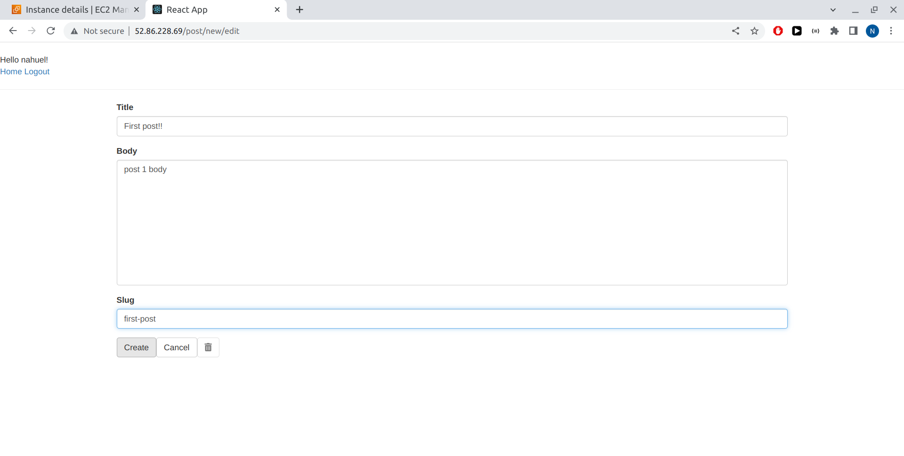
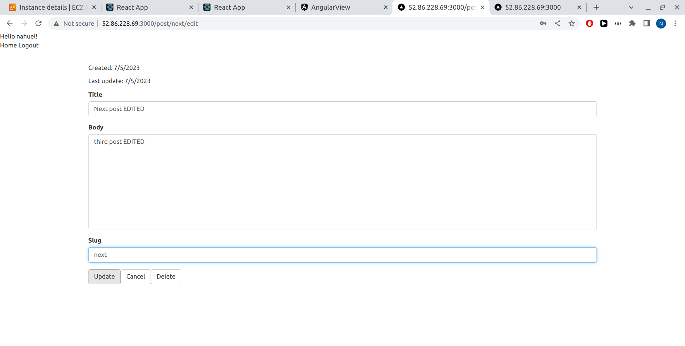

# Project Deployment Images #

## AWS Postgres DB page ##

## AWS EC2 Instance page ##

## Console Server Run ##

## Registering user on React (main) View ##

## Main View Home ##

## Main View Create post ##

## Angular View ##

## Next View ##

## Node Controller ##

## Django Model ##

## React view ##

## React view DELETE Post ##

## Server Console logs ##

# Start containers:

docker-compose up

# Visit apps

react_view: http://0.0.0.0:3500/

angular_view: http://0.0.0.0:4200/

next_view: http://0.0.0.0:3000/

node_controller: http://0.0.0.0:3030/

django_model: http://0.0.0.0:8000/

# Manage database:

docker exec -it postgres psql -h localhost -p 5432 -U postgres -W

password=(ENTER)

postgres does not ask for password if user access from same origin.
